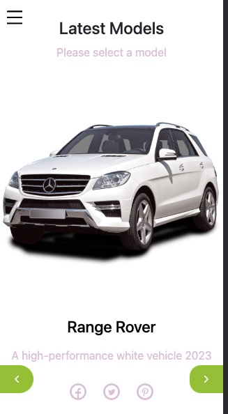

<a name="readme-top"></a>

<div align="center">
  <h3><b>Cars Rental Frontend</b></h3>
</div>
<a name="readme-top"></a>

<!-- TABLE OF CONTENTS -->

# 📗 Table of Contents

- [📗 Table of Contents](#-table-of-contents)
- [📖 Cars Rental Frontend ](#-cars-rental-frontend-)
  - [Live Demo](#live-demo)
  - [Desktop View](#desktop-view)
  - [Mobile View](#mobile-view)
  - [Kanban Board](#kanban-board)
  - [Backend](#backend)
  - [Contributors](#contributors)
  - [🛠 Built With ](#-built-with-)
    - [Tech Stack ](#tech-stack-)
    - [Key Features ](#key-features-)
  - [💻 Getting Started ](#-getting-started-)
  - [To get a local copy up and running, follow these steps.](#to-get-a-local-copy-up-and-running-follow-these-steps)
    - [Prerequisites](#prerequisites)
    - [Setup](#setup)
    - [Install](#install)
  - [👥 Authors ](#-authors-)
  - [🔭 Future Features ](#-future-features-)
  - [🤝 Contributing ](#-contributing-)
  - [⭐️ Show your support ](#️-show-your-support-)
  - [🙏 Acknowledgments ](#-acknowledgments-)
  - [📝 License ](#-license-)

<!-- PROJECT DESCRIPTION -->

# 📖 Cars Rental Frontend <a name="about-project"></a>

> Car Rentals Frontend is a React app that serves as a front end to the Car Rentals project.

## Live Demo

To see this project's live demo, please click [here](https://car-rentals-frontend.netlify.app/).

## Desktop View


## Mobile View



## Kanban Board

To view the Kanban Board we built for this project please click [here](https://github.com/users/demix007/projects/3).

To view the issue with the Kanban Board screenshots please click [here](https://github.com/demix007/car-rentals-backend/issues/18).

## Backend

Api documentation can be found [here](https://documenter.getpostman.com/view/26901652/2s93eZyBwq)

Api live demo can be found [here](https://cars-api.up.railway.app/)

## Contributors

There were 4 contributors to this project, you can see their contact information in the Authors section of this document.

## 🛠 Built With <a name="built-with"></a>

This app is build with React and Redux.

### Tech Stack <a name="tech-stack"></a>

> <li><a href="https://reactjs.org/">React</a></li>
> <li><a href="https://redux.js.org/">Redux</a></li>

### Key Features <a name="key-features"></a>

> - The login page where the user logs in to the website.
> - The home page where the user can see a list of cars and click on any car to display the details of that car.
> - The details page is where the user can click on the "Reserve" button to reserve the car.
> - The user can see a list of their reservations.
> - The user can add a new car.
> - The user can click on the delete button from the naviagtion panel and see a list of all cars with the car name and a "delete" button and then delete a particular car.
> - The deleted cars are removed from the home page.

<p align="right">(<a href="#readme-top">back to top</a>)</p>

<!-- GETTING STARTED -->

## 💻 Getting Started <a name="getting-started"></a>

## To get a local copy up and running, follow these steps.

### Prerequisites

In order to run this project you need:

- Mac or PC
- Install node.js
- Use npm as package manager.
- Understanding of React and Redux

### Setup

- Clone this repository to your desired folder:

```sh
 git clone https://github.com/houdamzari/Cars-Rental-FrontEnd.git
```

- Navigate into the cloned folder

```sh
 cd Cars-Rental-FrontEnd

```

### Install

- Install this project with:

```sh
 npm install
```

- Start the server

```sh
 npm start
```

<p align="right">(<a href="#readme-top">back to top</a>)</p>

<!-- AUTHORS -->

## 👥 Authors <a name="authors"></a>

👤 **Ayodeji Abidemi**

- GitHub: [](https://github.com/demix007)
- Twitter: [](https://twitter.com/dat_dope_demix)
- LinkedIn: [](https://linkedin.com/in/ayodeji-abidemi)

👤 **Mohamed Hassan Noor**

- GitHub: [](https://github.com/MohamedHNoor)
- Twitter: [](https://twitter.com/MohamedHNoor)
- LinkedIn: [](https://www.linkedin.com/in/mohamedhnoor/)

👤 **Houda Mzari**

- GitHub: [](https://github.com/houdamzari/)
- LinkedIn: [](https://www.linkedin.com/in/houda-mzari/)

👤 **Kashif Saleem**

- GitHub:[](https://github.com/Kashif-Saleem-Ghuman)
- Twitter:[](https://twitter.com/Kashif14Saleem)
- LinkedIn:[](https://www.linkedin.com/in/kashifsaleemghuman/)

<p align="right">(<a href="#readme-top">back to top</a>)</p>

<!-- FUTURE FEATURES -->

## 🔭 Future Features <a name="future-features"></a>

- [ ] **Allow users to choose a language for the application**
- [ ] **Add payment option**
- [ ] **Some UX improvements: include transitions and/or animations, etc.**

<p align="right">(<a href="#readme-top">back to top</a>)</p>

<!-- CONTRIBUTING -->

## 🤝 Contributing <a name="contributing"></a>

Contributions, issues, and feature requests are welcome!

Feel free to check the [issues page](https://github.com/houdamzari/Cars-Rental-FrontEnd/issues).

<p align="right">(<a href="#readme-top">back to top</a>)</p>

<!-- SUPPORT -->

## ⭐️ Show your support <a name="support"></a>

If you like this project, please leave a ⭐️

<p align="right">(<a href="#readme-top">back to top</a>)</p>

<!-- ACKNOWLEDGEMENTS -->

## 🙏 Acknowledgments <a name="acknowledgements"></a>

- We would like to thank Microverse for providing the reading materials that aided us to during the project development.
- We would like to give Credit to 🙏 Murat Korkmaz the author of the original Vespa- Responsive Redesign, as required by the Creative Commons License.

<p align="right">(<a href="#readme-top">back to top</a>)</p>

<!-- LICENSE -->

## 📝 License <a name="license"></a>

This project is [MIT](./License) licensed.

<p align="right">(<a href="#readme-top">back to top</a>)</p>
